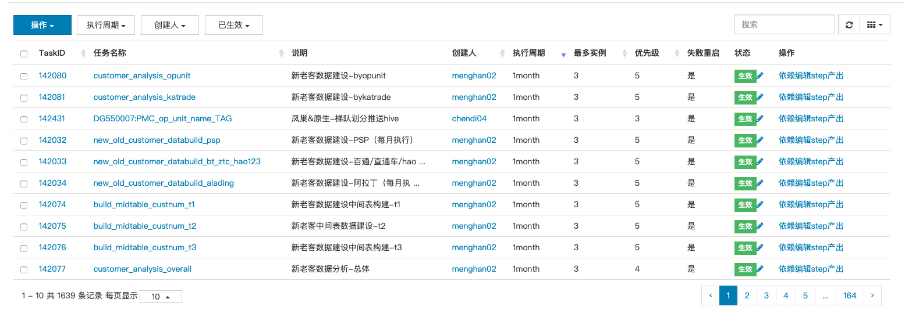

#### 分页 sidePagination
  ['client','server']
  client: 客户端分页
  server: 服务端分页，返回值必须 包含 [总数据条数'total'，数据'rows']
#### 搜索 search
  客户端分页 search 才生效，因为客户端分页他才有所有数据，否则search 参照这个queryParams
    将参数发送给后端排序,搜索等.
#### 格式化列 formatter
     直接在column 上处理formatter
#### 事件 events
    直接在column 上绑定events 事件，处理对应的逻辑
#### 编辑 editable
    编辑 table上的元素 具体操作参照 bootstrap-table-editable.js
***

效果图 eg:

